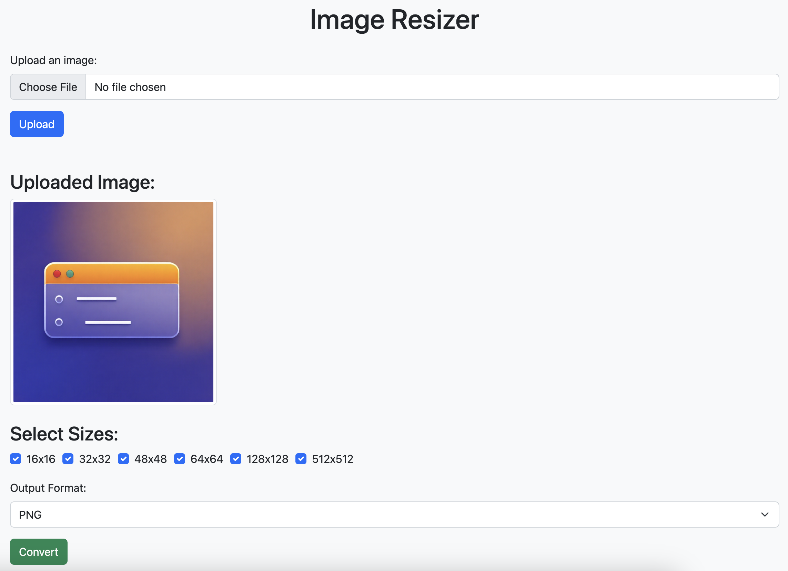
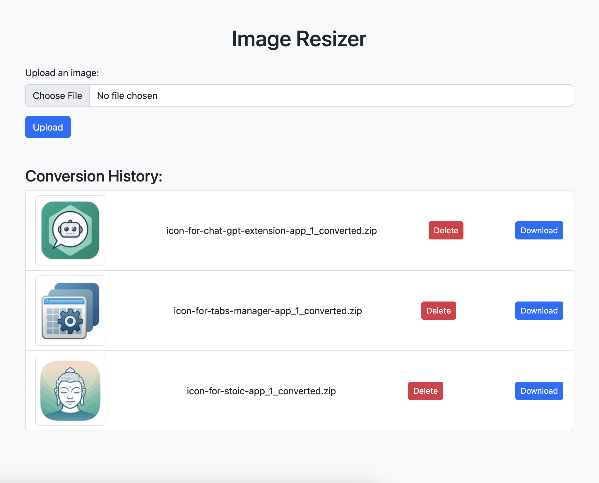

## Image Resizer

### Purpose
A fast way to create an icon pack from a single image by resizing it into multiple predefined sizes and packaging them into a zip archive.




### Docker Instructions
#### 1. Build and run with Docker:

```bash
docker-compose up --build
```

This starts the application at http://localhost:5050

#### 2. Stop containers:
```bash
docker-compose down
```

### Usage
Upload an image (PNG/JPG) for resizing.
Select desired sizes and download the zip archive containing resized images.
View and delete uploaded images from history.

### License
	MIT License